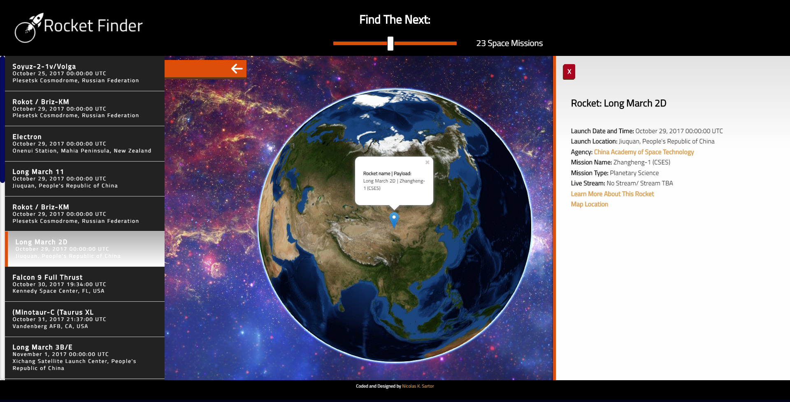

# Rocket Finder - APIHack

## About This Project:

### What it does:
This project utilizes launchlibrary.net API and WebGL Earth API to create an environment where the user can explore future scheduled space missions.

The users are able to browse through the missions, visualize their location on a 3D globe and browse through information related to the space missions and rockets they select.

### What it looks like:

You can access the live version of this project [here](https://devtrader.github.io/RocketFinder/).

